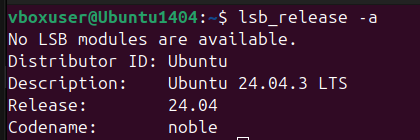
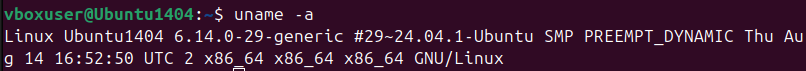
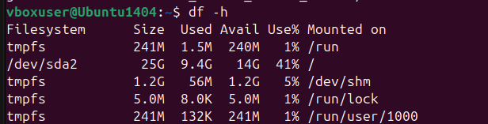
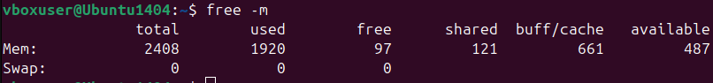

# **Installing Linux** (Ubuntu)

## Installation method -- 
```bash
**VirtualBox**
```

## Installation:

1- Installed VitualBox. <br>
2- Dowloaded latest Ubuntu LTS ISO from the browser.<br>
3- Created a new Virtual machine.<br>
4- Chose Linux operating system and inserted the ISO image downloaded earlier.<br>
5- Entered the required information (username, password) to setup the unattended guest OS installation.<br>
6- Speccifying hardware configuration. (minimum 2 GB RAM and 20 GB disk)<br>
7- Check everything once again before finishing.<br>

## Some terminal commands:

### 1- `lsb_release -a` --- shows Ubuntu version



### 2- `uname -a` --- kernel info



### 3- `df -h` --- disk usage



### 4- `free -m` --- memory usage



