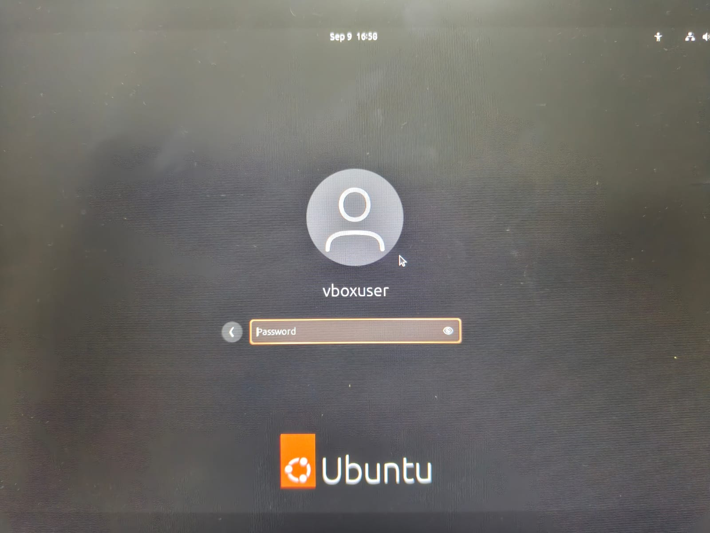

# **Installing Linux** (Ubuntu)

## Installation method -- 
```bash
**VirtualBox**
```

## Installation:

1- Installed VitualBox. <br>

2- Dowloaded latest Ubuntu LTS ISO from the browser.<br>

3- Created a new Virtual machine.<br>

4- Chose Linux operating system and inserted the ISO image downloaded earlier.<br>


5- Enter the required information (username, password) to setup the unattended guest OS installation.<br>


6- Specifying hardware configuration. (minimum 2 GB RAM and 20 GB disk)<br>


7- Check everything once again before finishing and login.<br>




## Some terminal commands:

### 1- `lsb_release -a` --- shows Ubuntu version


### 2- `uname -a` --- kernel info


### 3- `df -h` --- disk usage


### 4- `free -m` --- memory usage


## Reflection:
I installed Ubuntu in VirtualBox without major issues. At first, I had trouble with the display resolution, but after installing VirtualBox Guest Additions, everything worked smoothly. The process helped me understand how to allocate system resources like RAM and disk space.


# Extra Questions:
## Question 1.) What are two advantages of installing Ubuntu in VirtualBox?
### A: 1- You can run Ubuntu and your main OS at the same time. <br> 2- Easy to remove/reset without affecting your main system.  

## Question 2.) What are two advantages of dual booting instead of using a VM?
### A: 1- Better performance since Ubuntu uses the hardware directly. <br> 2- Access to full system resources like GPU acceleration and more disk space.  