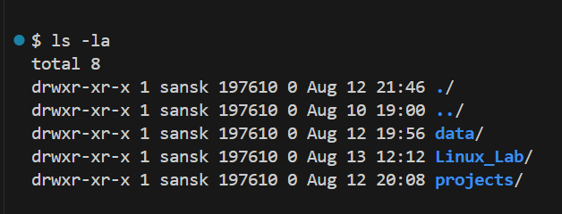
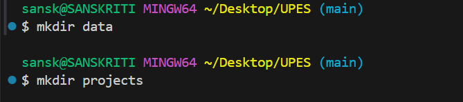
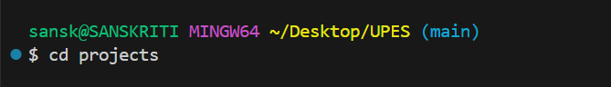
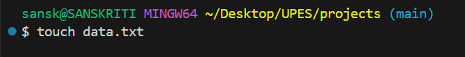
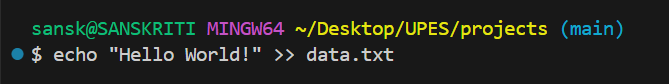

#    LINUX BASIC COMMANDS:

# "pwd" command:
```bash
>> pwd
```

## The output is as follows:

```bash
/home/vboxuser/Desktop/UPES/Linux_Lab/Assignments
```

# "ls" command:
```bash
>> ls           
>> ls -l        #Shows detailed list with permission, size and date
>> ls -a        #Shows hidden files too.
```

Explanation: This command lists all the files. 

## The output is as follows:




# "mkdir" command:
```bash
>> mkdir new_folder
```

Explanation: The mkdir command in Bash is used to create new directories (folders) in the file system. Here, we made two directories, data and projects.

## The output is as follows:




# "cd" command:
```bash
>> cd folder
```

Explanation: The cd command in Bash is used to change the current working directory so you can navigate around the file system. 

## The output is as follows:




# "touch" command:
```bash
>> touch file.txt
```

Explanation: The touch command in Bash is mainly used to create empty files or update the timestamp of existing files. Here, we made a txt file.

## The output is as follows:




# "echo" command:
```bash
>> echo "Hello world!"
```

Explanation: The echo command in Bash is used to display text or variables in the terminal, and it can also write output to files. Here, it is used to enter "Hello World!" in a txt file.

## The output is as follows:



-1.png>)


# "cat" command
```bash
>> cat file.txt
```

Explanation: This command is used to display contents of file.

## The output is as follows:

.png>)


# "nano" command:
```bash
>> nano file.txt
```

Explanation: The nano command in bash is used to open and edit text files in a simple terminal-based text editor.

## The output is as follows:

.png>)


# "clear" command:
```bash
>> clear
```

Explanation: This command is used to clear the terminal.


# "whoami" command:
```
>> whoami
```

Explanation: It prints the effective username of the current user.

## The output is as follows:


# "find" command:
```
>> find . -name "file.txt"
>> find . -name "*.txt"
```

Explanation: The find command in Linux is one of the most powerful tools for searching files and directories in a directory hierarchy.

## The output is as follows:


# "grep" command:
```
>> grep "Hello" file.txt
```

Explanation: This command is used for searching text patterns inside files or command outputs.

## The output is as follows:


# "rm" command:
```
>> rm file.txt
>> rm -r folder
```

Explanation: This command is used to remoove/delete files and directories.

## The output is as follows:


---
**THIS CONCLUDES THE BASIC LINUX COMMANDS.**
---


# FILE PERMISSIONS WITH "chmod" AND "chown"

# 1. File permissions in Linux:

### Each file/directory in Linux has-
* Owner --> The user who created the file.
* Group --> A group of users who may share access.
* Other --> Everyone else who has access.

### Permission type- 
* `r` --> Read (4 in numeric)
* `w` --> Write (2 in numeric)
* `x` --> Execute (1 in numeric)

### Example by using `ls -la`:

```bash
-rwx-rw-r--
```

Explanation:
* `rwx-` --> Read, write and execute permissions for the owner.
* `rw-` -->  Read and write permissions for the group.
* `r--` --> Read permission for the others.


# 2. "chmod"- Change file permissions:

## Numerical method- 
--> Use for quick changes.

Each permission is represented by a number:
* Read --> 4
* Write --> 2
* Execute --> 1


If we add them up, we get a number for each category (Owner, Group, Other):
* `7` --> `rwx`
* `6` --> `rw-`
* `5` --> `r-x`
* `4` --> `r--`
* `0` --> `---`

### Example:
```bash
chmod 765 script.sh
```
Explanation:
* 7 --> `rwx`
* 6 --> `rw-`
* 5 --> `r-x`


## Symbolic Method-
--> Use for fine adjustments. 

Use:
* `u` --> user
* `g` --> group
* `o` --> others
* `a` --> all

Operations:
* `+` --> To **Add** permission
* `-` --> To **Remove** permission
* `=` --> To **Assign exact** permission

### Usage:

```bash
chmod u+x script.sh     # Add execute for owner
chmod g-w notes.txt     # Remove write from group
chmod o=r file.txt      # Set others to read only
chmod a+r report.txt    # Everyone gets read access
chmod a+rwx data.txt    # Everyone gets all access
```


## Recursive Changes-

```bash
chmod -R 755 folder
```

* `R` --> It applies changes recursively to all files/subdirectories.

### Example:


# 3. "chown" – Change File Ownership:
```bash
chown [options] new_owner:new_group filename
```

### Usage:
```bash
chown vboxuser file.txt           # Change owner to user 'vboxuser'
chown vboxuser:hey file.txt       # Change owner to 'vboxuser' and group to 'hey'
chown :hey file.txt               # Change only group to 'hey'
chown -R vboxuser:hey /project    # Recursive ownership change
```

# 4. Putting it all together:

### Example:

```bash
touch project.sh
ls -l project.sh
```

### Output:

```
-rw-r--r-- 1 vboxuser hey 0 Aug 19 12:00 project.sh
```

### Some more uses:

```bash
chmod 700 project.sh           # To Only owner has rwx
chmod u+x,g-w project.sh       # To Add execute for user, remove write for group
chown root:admin project.sh    # To Change owner to root and group to admin
```

---
**This shows us how to use "chmod and "chown" commands.**
---


# EXTRA QUESTIONS:

## Question 1.) What is the difference between `chmod` and `chown`?
### A: `chmod` changes the file permissions (read, write, execute) of a file or directory whereas `chown` changes the ownership (user/group) of a file or directory.

## Question 2.) How do you check the current directory and user?
### A: To check current directory --> `pwd` command and To check current user --> `whoami` command.