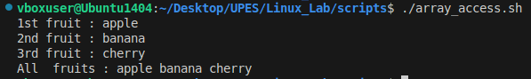
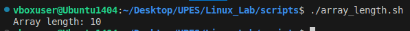

# Script Execution and Explanation.

## 1) Array access.
 USE ---> To access any particular element or all the elements of an array.

```bash
#!/bin/bash

fruits=("apple" "banana" "cherry")

echo "1st fruit : ${fruits[0]}"
echo "2nd fruit : ${fruits[1]}"
echo "3rd fruit : ${fruits[2]}"
echo "All  fruits : ${fruits[@]}"
```

### Explanation:
1. `#!/bin/bash`
* Shebang.
* It tells the system that the script should be excuted using bash shell. 

2. `fruits=("apple" "banana" "cherry")`
* This creates a Bash array named fruits.
* It has three elements:<br>
fruits[0] = apple <br>
fruits[1] = banana <br>
fruits[2] = cherry<br>

3. `echo "1st fruit : ${fruits[0]}"`
* Prints the first element of the array.

4. `echo "2nd fruit : ${fruits[1]}"`
* Prints the second element.

5. `echo "3rd fruit : ${fruits[2]}"`
* Prints the third element.

6. `echo "All fruits: ${fruits[@]}"`
* [@] expands to all elements of the array.


### Output:




## 2) Array length.
USE --> To print the number of elements in an array

```bash
#!/bin/bash

numbers=(1 2 3 4 5 6 7 8 9 10)
echo "Array length: ${#numbers[@]}"
```

### Explanation:
1. `#!/bin/bash`
* Shebang.
* It tells the system that the script should be excuted using bash shell.

2. `numbers=(1 2 3 4 5 6 7 8 9 10)`
* This creates a bash array named numbers.
* It has 10 elements.

3. `echo "Array length: ${#numbers[@]}"`
* `echo` prints text to the terminal.
* `${#numbers[@]}` is special:
    * `numbers[@]` means "all elements of the array".
    * `#` means number of elements in the array.

### Output:




# Extra questions.
## Question 1.) What is the purpose of `#!/bin/bash` on top of the script?
### A: This is called a shebang.It tells the system that the script should be executed using the Bash shell (located at /bin/bash).Without it, the script might run with a different shell (like sh), which could cause compatibility issues.

## Question 2.) How do you make a script executable?
### A: We can use the command `chmod 111 scriptname.sh` (numerical method to make it executable for user, group and others) or `chmod u+x scriptname.sh` (symbolic method to make it executable for user only).