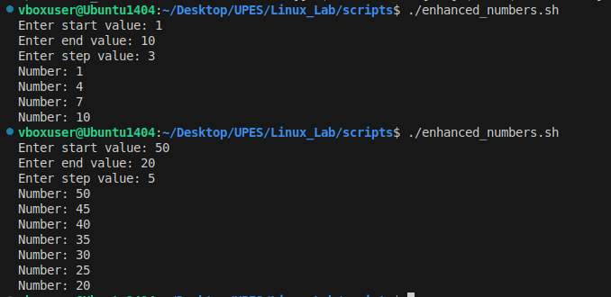

# Modifying An Existing Script:

## The script to be modified:

```bash
#!/bin/bash

for i in 1 2 3 4 5
do
echo "Number: $i"
done
```

## Modified script:

```bash
#!/bin/bash

read -p "Enter start value: " start
read -p "Enter end value: " end
read -p "Enter step value: " step

if [ "$step" -le 0 ]; then
echo "Step must be positive."
exit 1
fi

if ! [[ "$start" =~ ^-?[0-9]+$ ]] || ! [[ "$end" =~ ^-?[0-9]+$ ]] || ! [[ "$step" =~ ^[0-9]+$ ]]; then
echo "Start and end must be integers and step must be positive."
exit 1
fi

if [ $start -le $end ]; then
    for (( i=$start; i<=$end; i+=$step )); do
    echo "Number: $i"
    done
else
    for (( i=$start; i>=$end; i-=$step )); do
    echo "Number: $i"
    done
fi
```

### Sample runs:

After making it executable with `chmod 777 enhanced_numbers.sh`:




## Original vs New
- **Original Script (print_numbers.sh):**
  - Printed numbers from 1 to 10 with a fixed step of 1.
  - Behavior was static; user could not change start, end, or step.

- **Enhanced Script (enhanced_numbers.sh):**
  - User provides:
    - Start value
    - End value
    - Step value
  - Validates inputs:
    - Start and end must be integers.
    - Step must be a positive integer.
  - Supports both ascending and descending sequences.


# Extra questions
## Question 1.) Difference between `$1`, `$@` and `$#` in bash?
### A: `$1` --> Refers to the first positional argument passed to the script. <br> `$@` --> Refers to all arguments passed to the script, each preserved as a separate word. <br> `$#` --> Gives the number of arguments passed to the script.

## Question 2.) What does exit 1 mean in script?
### A: exit 1 stops the script and signals an error.