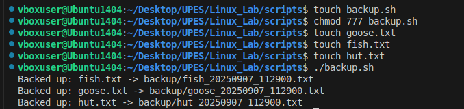
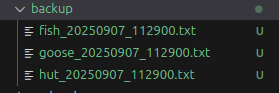

# File and Backup Automation.

## The script: `backup.sh`

```bash
#!/bin/bash

mkdir -p backup
timestamp=$(date +"%Y%m%d_%H%M%S")


for file in *.txt; do
    if [[ -f "$file" ]]; then
    base=$(basename "$file" .txt)

    cp "$file" "backup/${base}_${timestamp}.txt"
    echo "Backed up: $file -> backup/${base}_${timestamp}.txt"

    fi
done
```

## How the script runs?
1. The script first creates a folder called `backup` if it does not already exist.
2. It generates a timestamp using the current date and time (`YYYYMMDD_HHMMSS` format).
3. It searches for all `.txt` files in the current folder.
4. For each `.txt` file:
   - The filename is extracted (without extension).
   - The file is copied into the `backup/` directory.
   - The timestamp is added to the copied file’s name (e.g., `notes.txt` → `notes_20250907_143210.txt`).

This ensures that multiple backups can be made without overwriting older ones.


### Example run:

1- Make the script executable by `chmod 777 backup.sh`
2- Make some txt files by `touch goose.txt` and `touch fish.txt`
3- run the script by `./backup.sh`

### Output:





# Extra questions1:
## Question 1.) What is the difference between cp, mv and rsync?
### A: `cp` --> It makes a duplicate of the file/folder. The original one stays in place. <br> `mv` --> It moves the file from one place to another and can also rename it. The original is removed from its old location. <br> `rsync` --> It can copy locally or remotely and only copies differences.

## Question 2.) How can you schedule scripts to run auttomatically?
### A: With cronjobs --> `cron` is a  built-in scheduler. 