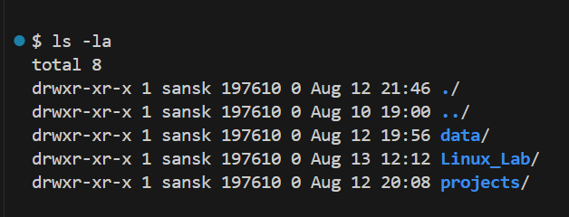
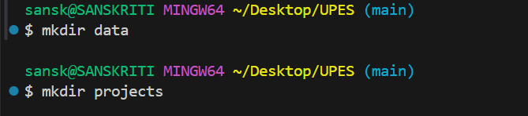
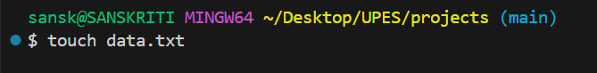
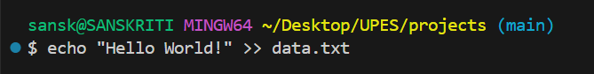

#    LINUX BASIC COMMANDS:

# "pwd" command:
```bash
>> pwd
```

## The output is as follows:

```bash
/c/Users/sansk/Desktop/UPES
```

# "ls" command:
```bash
>> ls
>> ls -l
>> ls -a
```

Explanation: This command lists all the files. 

## The output is as follows:




# "mkdir" command:
```bash
>> mkdir new_folder
```

Explanation: The mkdir command in Bash is used to create new directories (folders) in the file system. Here, we made two directories, data and projects.

## The output is as follows:




# "cd" command:
```bash
>> cd folder
```

Explanation: The cd command in Bash is used to change the current working directory so you can navigate around the file system. 

## The output is as follows:


# "touch" command:
```bash
>> touch file.txt
```

Explanation: The touch command in Bash is mainly used to create empty files or update the timestamp of existing files. Here, we made a txt file.

## The output is as follows:




# "echo" command:
```bash
>> echo "Hello world!"
```

Explanation: The echo command in Bash is used to display text or variables in the terminal, and it can also write output to files. Here, it is used to enter "Hello World!" in a txt file.

## The output is as follows:



-1.png>)


# "cat" command
```bash
>> cat file.txt
```

Explanation: This command is used to display contents of file.

## The output is as follows:

.png>)


# "nano" command:
```bash
>> nano file.txt
```

Explanation: The nano command in bash is used to open and edit text files in a simple terminal-based text editor.

## The output is as follows:

.png>)


# "clear" command:
```bash
>> clear
```

Explanation: This command is used to clear the terminal.


# "whoami" command:
```
>> whoami
```

Explanation: It prints the effective username of the current user.

## The output is as follows:


# "find" command:
```
>> find . -name "file.txt"
>> find . -name "*.txt"
```

Explanation: The find command in Linux is one of the most powerful tools for searching files and directories in a directory hierarchy.

## The output is as follows:


# "grep" command:
```
>> grep "Hello" file.txt
```

Explanation: This command is used for searching text patterns inside files or command outputs.

## The output is as follows:


# "rm" command:
```
>> rm file.txt
>> rm -r folder
```

Explanation: This command is used to remoove/delete files and directories.

## The output is as follows:


# THIS CONCLUDES THE BASIC LINUX COMMANDS.