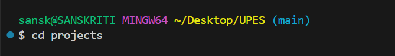

#    Linux basic commands:

## "pwd" command:
```bash
>> pwd
```

# The output is as follows:

```bash
/c/Users/sansk/Desktop/UPES
```

## "ls" command:
```bash
>> ls
```

Explanation: This command lists all the files. 

### The output is as follows:


## "mkdir" command:
```bash
>> mkdir
```

Explanation: The mkdir command in Bash is used to create new directories (folders) in the file system. Here, we made two directories, data and projects.

### The output is as follows:


## "cd" command:
```bash
>> cd
```

Explanation: The cd command in Bash is used to change the current working directory so you can navigate around the file system. 

### The output is as follows:




## "touch" command:
```bash
>> touch
```

Explanation: The touch command in Bash is mainly used to create empty files or update the timestamp of existing files. Here, we made a txt file.

### The output is as follows:


## "echo" command:
```bash
>> echo
```

Explanation: The echo command in Bash is used to display text or variables in the terminal, and it can also write output to files. Here, it is used to enter "Hello World!" in a txt file.

### The output is as follows:


-1.png>)


## "cat" command
```bash
>> cat
```

Explanation: This command is used to display contents of file.

### The output is as follows:

.png>)


## "nano" command:
```bash
>> nano
```

Explanation: The nano command in bash is used to open and edit text files in a simple terminal-based text editor.

### The output is as follows:

.png>)


## "clear" command
```bash
>> clear
```

Explanation: This command is used to clear the terminal.


## "whoami" command:
