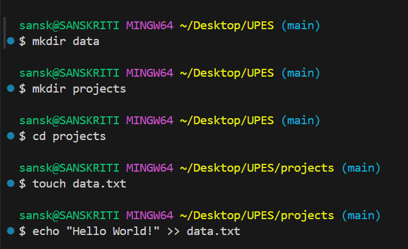

# Experiment 1

We will be walking thourgh basic linux terminal commands.

# Prerequisites:
1- Install GitBash.
2- In VS code, open the terminal and select gitbash from the drop down.

## Command "mkdir"
The mkdir command in Bash is used to create new directories (folders) in the file system. Here, we made two directories, data and projects.

## Command "cd"
The cd command in Bash is used to change the current working directory so you can navigate around the file system. 

## Command "touch"
The touch command in Bash is mainly used to create empty files or update the timestamp of existing files. Here, we made a txt file.

## Command "echo"
The echo command in Bash is used to display text or variables in the terminal, and it can also write output to files. Here, it is used to enter "Hello World!" in a txt file. 

## Image

-1.png>)
.png>)