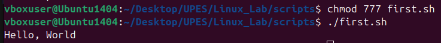
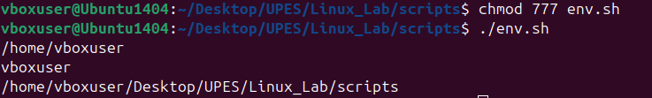
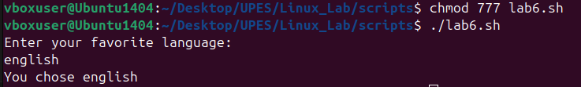
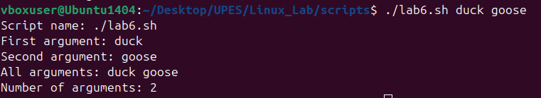
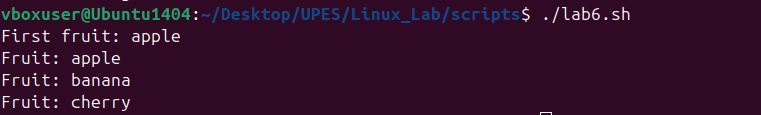

# Shell Scripting.

It allows you to automate tasks in Linux/Unix by writing commands inside a file that the shell executes line by line.


##  1. Shell Script:

* A shell is a command-line interpreter (for example: `bash`, `zsh`, `sh`).
* A shell script is a text file with a series of commands.
* File usually has `.sh` extension, though not mandatory.

### Example:

```bash
#!/bin/bash
echo "Hello, World!"
```

**Make it executable before running it.**

### Output:




## 2. Variables

Variables store data (text, numbers, paths, etc.).

### Defining variables

```bash
name="Sanskriti"
age=18
```


### Accessing variables

```bash
echo "My name is $name and I am $age years old."
```

### Output:


### Environment variables

```bash
echo $HOME   # home directory
echo $USER   # current user
echo $PWD    # present working directory
```

### Output:



## 3. User Input

Read input from user with "read".

```bash
#!/bin/bash
echo "Enter your favorite language:"
read lang
echo "You chose $lang"
```

### Output:




## 4. Conditional Statements (if-else)

```bash
#!/bin/bash
num=10

if [ $num -gt 5 ]; then
    echo "Number is greater than 5"
else
    echo "Number is less than or equal to 5"
fi
```

Operators:

* `-eq` (equal)
* `-ne` (not equal)
* `-gt` (greater than)
* `-lt` (less than)
* `-ge` (greater or equal)
* `-le` (less or equal)


## 5. Loops

### For loop

```bash
for i in 1 2 3 4 5
do
    echo "Number: $i"
done
```

Or use a range:

```bash
for i in {1..5}
do
    echo "Iteration $i"
done
```

### While loop

```bash
count=1
while [ $count -le 5 ]
do
    echo "Count: $count"
    ((count++))   # increment
done
```

### Until loop

Runs until condition becomes true.

```bash
x=1
until [ $x -gt 5 ]
do
    echo "Value: $x"
    ((x++))
done
```


## 6. Functions

Encapsulate reusable code.

```bash
greet() {
    echo "Hello, $1"
}

greet Sanskriti
greet Shell
```

### Output:
```bash
Hello, Sanskriti
Hello, Shell
```


## 7. Command Line Arguments

Access arguments passed to script:

```bash
#!/bin/bash
echo "Script name: $0"
echo "First argument: $1"
echo "Second argument: $2"
echo "All arguments: $@"
echo "Number of arguments: $#"
```

### Run:

```bash
./script.sh duck goose
```

### Output:




## 8. Arrays

```bash
fruits=("apple" "banana" "cherry")

echo "First fruit: ${fruits[0]}"

for fruit in "${fruits[@]}"; do
    echo "Fruit: $fruit"
done
```

### Output




## 9. Useful Commands in Scripts

* `date` → show current date/time
* `whoami` → show current user
* `ls` → list files
* `pwd` → print working directory
* `cat` → read file contents